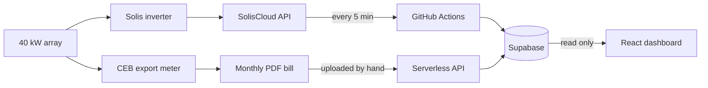
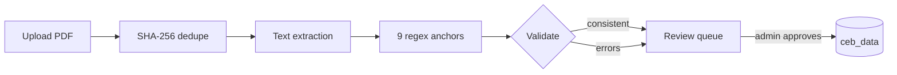
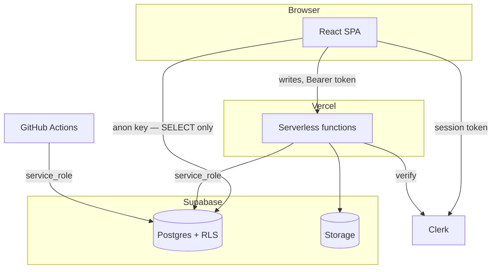

<div align="center">

<picture>
  <source media="(prefers-color-scheme: dark)" srcset="public/logo_wText.png">
  
</picture>

### Solar Analytics Dashboard

**Does what your solar array generated match what the utility actually paid for?**

A production monitoring dashboard for a 40 kW rooftop array in Sri Lanka. It reconciles
inverter telemetry against Ceylon Electricity Board bills — so under-billing becomes visible
instead of invisible.

[**Live site**](https://solaredge.anujajay.com) · [**Architecture**](docs/ARCHITECTURE.md) · [**API**](docs/API.md) · [**Runbook**](docs/RUNBOOK.md)

<br>


</div>

---

## Overview

Most solar dashboards show you one number: what your inverter produced. That number is easy to
get and, on its own, tells you nothing about whether you were paid correctly.

This project tracks **two** independent accounts of the same sunlight and holds them against
each other:

| | Source | Cadence | Access |
| --- | --- | --- | --- |
| **Generation** | Solis inverter via SolisCloud API | every 5 minutes | automated |
| **Payment** | CEB export meter via monthly PDF bill | monthly | manual upload, parsed |

Joining them is harder than it sounds. The two sources share no identifiers, no schedule, and
no definition of a "month" — and only one of them has an API. Nearly every design decision in
this codebase follows from that asymmetry.

**Scope:** one site, one inverter (SN `1811040244070066`), one utility account. This is
production software with a single operator, not a multi-tenant product.

---

## How it works



### Pipeline A — inverter telemetry

Runs unattended. A GitHub Actions cron signs an HMAC-SHA1 request to SolisCloud every five
minutes and writes to `inverter_data_live`; a second job aggregates that into daily totals. A
Supabase Edge Function serves the live-power widget directly, retrying SolisCloud's gateway —
which fails roughly 13% of the time — with exponential backoff and jitter.

### Pipeline B — CEB bills

Has a human in it, on purpose.



**The extractor is not OCR and not AI.** It is `pdfjs-dist` text extraction plus nine regex
anchors pinned to the bill's text layout. Validation cross-checks three things:

| Check | Assertion |
| --- | --- |
| Tariff maths | `units_exported × rate == earnings` (±Rs 1) |
| Meter delta | `meter_current − meter_previous == units_exported` |
| Timeline | `period_start < period_end` |

Passing all three proves a bill is *internally consistent*. It cannot prove the right bill was
parsed, or that the regexes latched onto the right table rows — so every extraction reaches a
human before it becomes data.

---

## The rule that governs everything

> **A bill received in month N reports generation from month N−1.**

Comparison windows come from bill dates, never calendar months:

```
periodEnd   = bill_date
periodStart = previous bill_date + 1 day     (fallback: bill_date − 30 days)
inverter    = Σ daily generation within that window
```

Why it matters:

```
          Jul 1              Aug 1              Sep 1
Calendar  |──── July ─────────|──── August ───────|
                                                   
Bills           |─ bill 4 Aug ─|─ bill 3 Sep ──────|
                6 Jul → 4 Aug   5 Aug → 3 Sep
```

Label the 3 September bill "September generation" and you attribute a month of August sunshine
to September. Every figure downstream is then wrong by one month — and because solar output
varies seasonally, wrong in a way that still looks entirely plausible.

**`null` is not `0`.** `null` means unavailable; `0` means a measured zero. A fabricated zero
is indistinguishable from a real one once stored, and drags every average down while looking
like data.

Full specification: [`docs/logic-registry/LR-001`](docs/logic-registry).

---

## Architecture



Three credential scopes, and keeping them apart *is* the security model:

| Actor | Credential | Permitted |
| --- | --- | --- |
| Browser | `VITE_SUPABASE_ANON_KEY` — public, ships in the bundle | `SELECT` only, enforced by RLS |
| Serverless function | `SUPABASE_SERVICE_KEY` — secret | Everything; behind admin auth |
| GitHub Actions | `SUPABASE_SERVICE_KEY` — secret, configured separately | Everything |

**The browser never writes.** Every mutation goes through an admin-authenticated `/api/*`
endpoint. Authorization is Clerk `publicMetadata.role === 'admin'`, verified server-side,
failing closed.

---

## Tech stack

| Layer | Choice |
| --- | --- |
| Framework | React 19, JavaScript ESM (no TypeScript) |
| Build | Vite 7 |
| Hosting | Vercel — SPA + serverless functions |
| Database | Supabase Postgres with row-level security |
| Storage | Supabase Storage (bill PDFs) |
| Auth | Clerk |
| Charts | Recharts 3 |
| UI | Chakra UI 3, custom CSS variables for theming |
| PDF | pdfjs-dist (parsing) · react-pdf (preview) |
| Icons | Lucide |
| Scheduling | GitHub Actions cron |
| Testing | Vitest — 91 tests |
| Data fetching | Custom stale-while-revalidate cache with circuit breaker |

---

## Features

**Monitoring**
- Live power, daily generation and inverter status, refreshed every 5 minutes
- Interactive generation and earnings charts across bill-aligned periods
- Daily target tracking and environmental impact estimates
- Dark and light themes, responsive to mobile

**Bill pipeline**
- PDF upload with SHA-256 deduplication before storage
- Automatic extraction with confidence scoring and three-way validation
- Human verification queue with inline editing
- Supports both the pre-2026 and 2026 `ebill-edl-v.1.0.2` bill formats

**Operations**
- `/healthz` liveness and `/ready` readiness probes
- Automated freshness alerting — opens an issue when data stops arriving
- Manual database snapshots and gap backfill, dry-run by default
- Keepalive to stop GitHub disabling scheduled workflows for inactivity

---

## Getting started

**Requires Node.js 22+ and pnpm.**

```bash
git clone https://github.com/Anuja-jayasinghe/Solar-Analytics-Dashboard.git
cd Solar-Analytics-Dashboard
pnpm install

cp .env.example .env      # every variable is documented inline
pnpm dev
```

| Command | Purpose |
| --- | --- |
| `pnpm dev` | Development server |
| `pnpm test` | Vitest — 91 tests |
| `pnpm lint` | ESLint — 0 errors expected |
| `pnpm build` | Production build |
| `pnpm audit --prod --audit-level high` | The CI security gate |

CI runs lint, test, build and the production audit. All four must pass.

---

## Project structure

```
api/                      Vercel serverless functions (10 of 12 used)
├── _lib/                 Shared code — excluded from the function count
│   ├── supabaseServer.js   One server client, with a key-role assertion
│   ├── cebBillParser.js    Pure regex parser and validator
│   ├── pdfText.js          pdfjs-dist text extraction
│   └── httpSecurity.js     CORS allowlist and method gating
├── ceb-bills/            upload · extract · records · ingestions · delete
└── health.js             /healthz and /ready

src/
├── lib/dataService.js    Read layer and bill-period alignment
├── contexts/             Auth, data and theme providers
├── pages/                Landing · dashboards · settings · admin
└── components/           UI, including the bill verification queue

functions/                GitHub Actions collectors
supabase/functions/       Supabase Edge Functions (Deno)
scripts/sql/              Schema baseline and RLS migrations
docs/                     Architecture, API, runbook, logic registry
tests/                    91 tests across 6 files
```

---

## Documentation

| Document | Contents |
| --- | --- |
| [Architecture](docs/ARCHITECTURE.md) | System design, both pipelines, data model, security — with diagrams |
| [API Reference](docs/API.md) | Every endpoint, auth model, request and error shapes |
| [Runbook](docs/RUNBOOK.md) | Operating procedures and incident response |
| [Logic Registry](docs/logic-registry) | Specifications for the non-obvious domain rules |

The repository also keeps a deliberate historical record — the
[project audit](docs/PROJECT_AUDIT_2026-09.md), the
[recovery write-up](docs/RECOVERY_STATUS_2026-09.md) and the
[pipeline safeguards](docs/DATA_PIPELINE_SAFEGUARDS.md) — documenting a five-month silent data
outage and the countermeasures built afterwards. Where the record and the reference documents
disagree, the reference documents are current.

---

## Project status

Version 2.1.0 is the last known-good state before a planned UI redesign.

| | |
| --- | --- |
| Bills reconciled | 25, from 2024-09-05 to 2026-09-03, no duplicates |
| Verification | Every field diffed against both source PDF and database |
| Independent checksum | Summed `units_exported` equals the 19,799 kWh meter delta |
| Lighthouse | Performance 70 · Accessibility 100 · Best Practices 100 · SEO 100 |

Performance is deliberately held at 70: LCP is dominated by render delay rather than network
(TTFB is ~900 ms), and that render path is what the upcoming redesign rewrites.

---

## License

Released under the [MIT License](LICENSE).

---

<div align="center">

**Built by [Anuja Jayasinghe](https://anujajay.com)**

Software Engineering undergraduate · SWE Intern at WSO2

[**Portfolio**](https://anujajay.com) · [**GitHub**](https://github.com/Anuja-jayasinghe) · [**Live project**](https://solaredge.anujajay.com)

</div>
