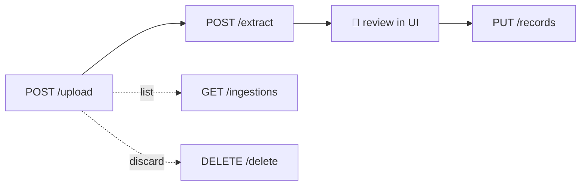

# API Reference

Every HTTP endpoint this project exposes. Base URL: `https://solaredge.anujajay.com`.

See [`ARCHITECTURE.md`](./ARCHITECTURE.md) for how these fit together and
[`RUNBOOK.md`](./RUNBOOK.md) for operating them.

---

## Conventions that apply to every endpoint

**Authentication.** Everything except the health probes requires a Clerk session token:

```
Authorization: Bearer <clerk-session-token>
```

`api/middleware/verifyAdminToken.js` verifies it with `@clerk/backend`'s `verifyToken`, then
fetches the user and requires `publicMetadata.role === 'admin'`. It **fails closed** — any
error verifying, any missing claim, any non-admin role is a rejection, never a pass-through.

**CORS.** An allowlist, not `*`. Defaults to the production domain, localhost dev ports, and
this project's Vercel preview deployments. `ALLOWED_ORIGINS` **replaces** those defaults rather
than adding to them.

**Method gating.** `handlePreflightAndMethod(req, res, [...])` answers `OPTIONS` and rejects
anything outside the declared list with `405`.

**Errors.** JSON, shaped `{ error: string, details?: string | string[] }`.

| Status | Meaning |
|---|---|
| `400` | Malformed request — missing field, bad type, unparseable body |
| `401` | No token, expired token, or verification failed |
| `403` | Valid token, but not an admin |
| `404` | Referenced row does not exist |
| `405` | Method not in the endpoint's allowlist |
| `409` | Conflict — currently only duplicate-bill detection |
| `429` | Rate limited (`/api/solis/explore` only) |
| `500` | Unhandled — or a configuration problem, which says so explicitly |
| `503` | `/ready` only: a dependency is down |

> A `500` whose body names `SUPABASE_SERVICE_KEY` is a **configuration** error, not a bug.
> See [§ Config errors](#config-errors).

---

## Health probes

Unauthenticated by design. Both are served by a single function (`api/health.js`) via rewrites
in `vercel.json`, because Vercel Hobby caps the project at 12 functions.

### `GET /healthz` — liveness

"Is the process running?" **No dependency checks, ever** — it must not fail because Supabase is
down, or a health-check consumer would recycle healthy instances during someone else's outage.

`200` always, if the runtime booted:

```json
{
  "status": "ok",
  "probe": "live",
  "revision": "ca87c7e",
  "uptime_s": 12,
  "timestamp": "2026-09-13T11:42:00.000Z"
}
```

### `GET /ready` — readiness

"Can this instance actually serve?" Checks configuration and reaches Postgres with a **3-second
timeout**. `200` when ready, `503` when not.

```json
{
  "status": "ok",
  "probe": "ready",
  "revision": "ca87c7e",
  "checks": {
    "config": { "ok": true },
    "supabase": { "ok": true, "latency_ms": 87 },
    "service_key_role": "service_role"
  },
  "timestamp": "2026-09-13T11:42:00.000Z"
}
```

`service_key_role` reports the **role** of the configured Supabase key, never the key. An
`anon` value there is the misconfiguration that caused the five-month outage — reads keep
working while every write fails RLS, so the app looks healthy from every other angle. This
field exists to make that state observable without reading logs.

`null` means an opaque `sb_secret_…` / `sb_publishable_…` key whose role can't be read locally.

---

## CEB bill pipeline

The four endpoints below are one workflow. Order matters.



### `POST /api/ceb-bills/upload`

Accepts a bill PDF as `multipart/form-data`, field name `file`.

Computes SHA-256 over the bytes and checks it against `ceb_bill_ingestions` **before** storing,
so re-uploading the same bill is a no-op rather than a duplicate.

| Status | Body |
|---|---|
| `201` | `{ ingestion: {...} }` — stored, `status: "received"` |
| `400` | Missing `file` field, empty file, or not a PDF |
| `409` | `{ error, existingIngestion }` — this exact file is already ingested |

> Real bills contain the account holder's name, address and phone number. They are gitignored
> (`resources/*`), and any test fixture derived from one must be redacted.

### `POST /api/ceb-bills/extract`

```json
{ "ingestionId": "uuid" }
```

Downloads the PDF from Storage, extracts text with `pdfjs-dist`, runs the nine regex anchors,
validates, and writes a `ceb_bill_extractions` row. Re-running deletes prior extractions for
that ingestion first, so it is idempotent.

Returns `200` with `{ success, extraction, validation }`:

```json
{
  "validation": {
    "status": "auto_approved",
    "confidence_score": 100,
    "validation_errors": [],
    "notes": []
  }
}
```

`status` is `auto_approved` or `pending_review`, decided by **blocking errors only**. `notes`
(e.g. "the bill states a different tariff than `system_settings`") ride along in
`validation_errors` for the reviewer but do not downgrade the status — conflating the two
silently sent good extractions to manual review.

Validation cross-checks three things:

| Check | Assertion |
|---|---|
| Tariff maths | `units_exported × rate == earnings` (±Rs 1) |
| Meter delta | `meter_current − meter_previous == units_exported` |
| Timeline | `billing_period_start < billing_period_end` |

The rate comes from the bill itself when present (the 2026 format prints
`Export Rate (Rs.) 37.00`), falling back to `system_settings.rate_per_kwh`. Preferring the
on-bill rate makes the check self-contained: a tariff change no longer makes every
correctly-parsed bill fail validation in a way that looks exactly like a parser fault.

`400` if `ingestionId` is missing, the file isn't a PDF, or the ingestion is already
`approved`. On any internal failure the ingestion is marked `failed_extraction` rather than
left stuck at `received`.

### `GET /api/ceb-bills/ingestions`

`200` → `{ files: [...] }`. Ingestions with their extractions joined, for the review queue.

### `POST` | `PATCH` | `PUT /api/ceb-bills/records`

Promotes a reviewed extraction into `ceb_data` — the canonical billing table.

| Method | Purpose | Body |
|---|---|---|
| `POST` | Insert a new record | `{ record }` |
| `PATCH` | Edit an existing one | `{ id, record }` |
| `PUT` | Upsert + mark the ingestion `approved` | `{ record }` |

`400` returns `{ error: "Invalid record", details: [...] }` listing each field that failed
validation.

This endpoint exists because these writes used to happen from the browser. They cannot: the
anon key has `SELECT` and nothing else.

### `POST` | `DELETE /api/ceb-bills/delete`

`{ ingestionId }` — removes the stored file, its ingestion row, its extractions, **and any
`ceb_data` row derived from it**. Fully destructive. `404` if unknown.

### `POST` | `DELETE /api/ceb-bills/delete-record`

`{ recordId }` — removes a `ceb_data` row and its associated files.

---

## Settings

### `PUT` | `POST /api/settings`

- `PUT` — one setting: `{ id, setting_value }`
- `POST` — several: `{ settings: [{ id, setting_value }, ...] }`

`200` → `{ setting }` or `{ settings }`. `400` on a missing id or a value that fails the
per-setting type check; `403` if the setting is not editable; `404` if unknown.

`rate_per_kwh` is the one that matters — it is the fallback tariff for validating bills that
don't print their own rate.

---

## Users

### `GET` | `POST` | `PATCH` | `DELETE /api/admin/users/[userId]`

Clerk user administration. `GET` without a `userId` lists users; with one, returns that user.
`PATCH` accepts `{ role, dashboardAccess }` and rejects an empty update with `400`.

---

## SolisCloud debug proxy

### `POST /api/solis/explore`

```json
{ "endpointKey": "inverterDetail", "params": { } }
```

Signs and forwards a request to SolisCloud. **Rate limited** — `429` when exceeded.
`endpointKey` must name a pre-registered endpoint; arbitrary URLs are not accepted.

This is a diagnostic tool, not part of the data path. The scheduled collectors in `functions/`
call SolisCloud directly.

---

## Config errors

A misconfigured deployment answers with an explanation rather than a bare `500`:

```json
{
  "error": "Supabase server key is not a service_role key",
  "details": "SUPABASE_SERVICE_KEY carries role \"anon\". Server endpoints write to tables whose RLS policies only permit the service role, so every write will be rejected. Set the service_role (secret) key from Supabase → Project Settings → API — on Vercel AND as the GitHub Actions secret; they are configured separately."
}
```

Checked **before** any database work, so a bad deployment fails cleanly instead of halfway
through — which is how an earlier version left orphaned files in Storage after the `ceb_data`
insert was rejected.

The key is accepted under either `SUPABASE_SERVICE_KEY` or `SUPABASE_SERVICE_ROLE_KEY`. Both
mean the same thing; the dashboard labels it `service_role`, so that is the name people reach
for first, and guessing wrong cost a production outage once already.

---

## Not an API

`api/_lib/` and `api/_config/` are **not** routes. The leading underscore excludes them from
Vercel's function count, which is why shared code lives there — the Hobby plan caps this
project at 12 functions and it currently uses 10.
