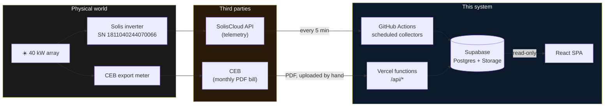
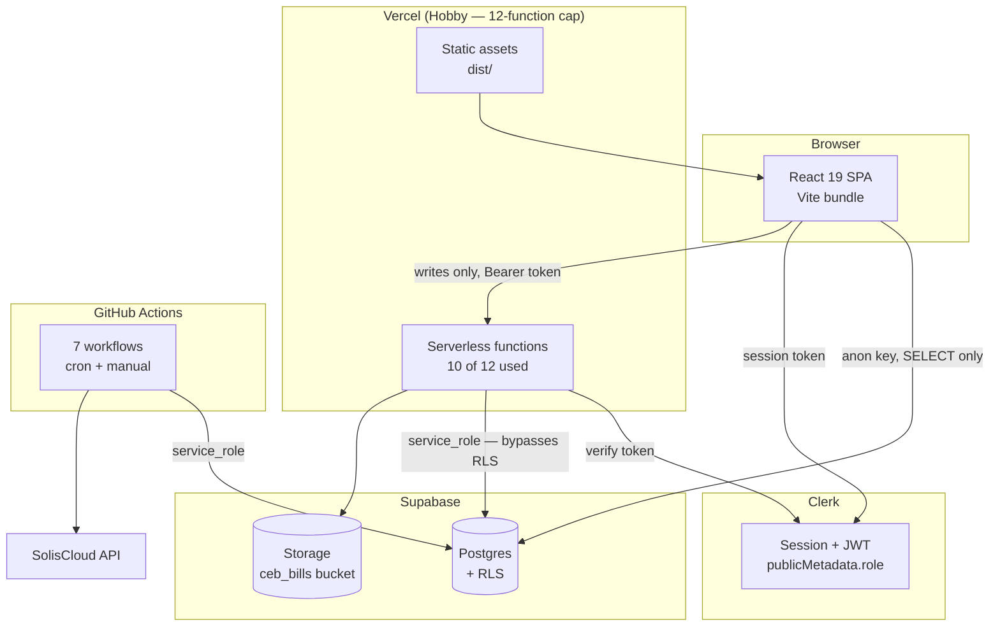
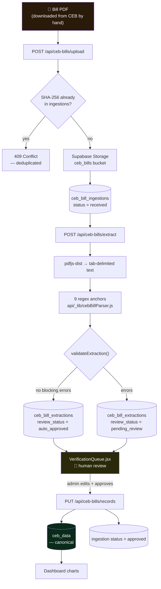
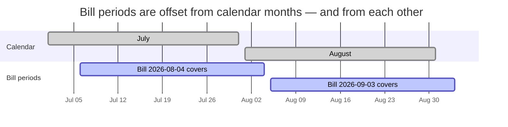
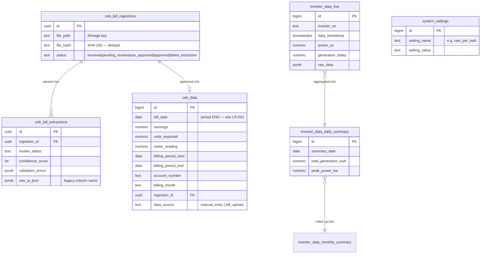
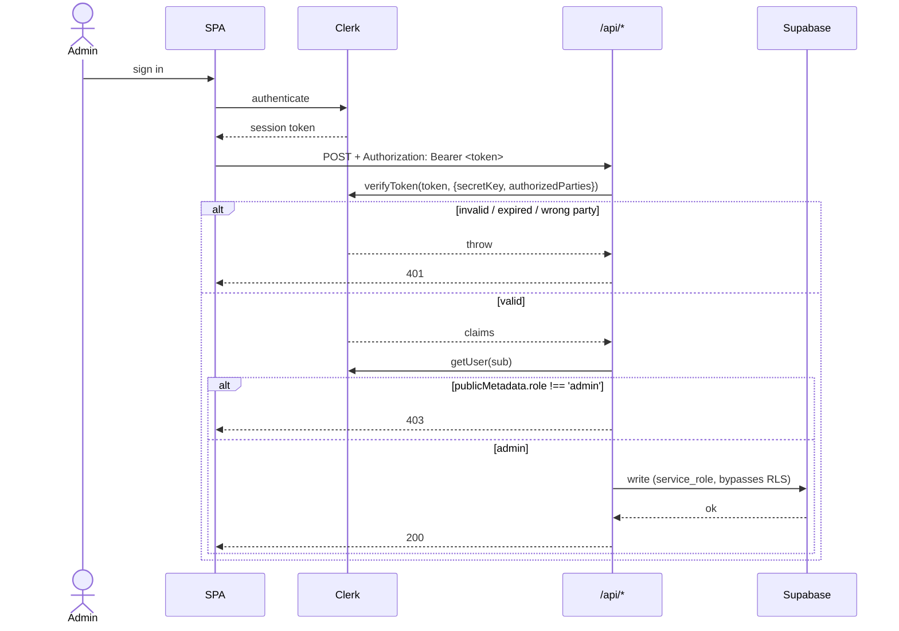

# Architecture

How the Solar Analytics Dashboard is put together, and — more usefully — *why* it is put
together that way. Most of the odd-looking decisions here are scar tissue from a specific
failure; those are called out as they come up.

Companion documents: [`API.md`](./API.md) for the endpoint contracts,
[`RUNBOOK.md`](./RUNBOOK.md) for operating it, [`logic-registry/`](./logic-registry) for the
domain rules.

---

## 1. What the system is for

One rooftop solar array, one inverter (SN `1811040244070066`, 40 kW), one utility account with
the Ceylon Electricity Board. The question the whole system exists to answer:

> **Does what the utility paid for match what the array actually generated?**

Answering it means reconciling two data sources that have nothing in common — different
owners, different cadences, different notions of a "month", and only one of which has an API.



The asymmetry in that diagram is the central design constraint. The inverter side is
**automated and continuous**; the CEB side is **manual, monthly, and arrives as a PDF designed
for human eyes**. Everything awkward about this codebase follows from trying to join those two.

---

## 2. Deployment topology



Three separate credential scopes, and **keeping them separate is the security model**:

| Actor | Credential | Can do |
|---|---|---|
| Browser | `VITE_SUPABASE_ANON_KEY` (public, shipped in the bundle) | `SELECT` only. RLS enforces it. |
| Serverless function | `SUPABASE_SERVICE_KEY` (service_role, server-only) | Everything. Bypasses RLS. |
| GitHub Actions | `SUPABASE_SERVICE_KEY` repo secret | Everything. Bypasses RLS. |

> **The rule:** the browser never writes. Every mutation goes through an
> admin-authenticated `/api/*` endpoint. A client-side `.insert()` / `.update()` /
> `.upsert()` is a bug, not a shortcut — RLS will reject it anyway, and the rejection surfaces
> as an unexplained 500.

Vercel's Hobby plan caps the project at **12 serverless functions**. Files under `api/_lib/`
and `api/_config/` are excluded from that count because of the leading underscore, which is why
shared code lives there. The count is currently 10 — `/healthz` and `/ready` deliberately share
one handler rather than taking two slots.

---

## 3. Pipeline A — inverter telemetry

Fully automated. No human in the loop.

```mermaid
sequenceDiagram
    participant C as GitHub Actions cron
    participant S as SolisCloud API
    participant DB as Supabase

    rect rgb(20,40,20)
    note over C,DB: every 5 minutes
    C->>S: POST /v1/api/inverterDetail<br/>(HMAC-SHA1 signed)
    S-->>C: power_ac, generation_today, temp, status
    C->>DB: INSERT inverter_data_live
    end

    rect rgb(40,30,10)
    note over C,DB: twice daily
    C->>DB: SELECT today's live rows
    C->>C: aggregate → total_generation_kwh, peak_power_kw
    C->>DB: UPSERT inverter_data_daily_summary
    end
```



SolisCloud authenticates with an HMAC-SHA1 signature over a canonical request string
(`api/_lib/solisAuth.js`). That module is **server-only** — it was moved out of `src/lib/`
precisely because anything under `src/` can be imported into the browser bundle, and a signing
secret in the bundle is a published secret.

### The live-power widget takes a third path

Separate from the cron collectors, the dashboard's current-power reading comes from a Supabase
**Edge Function**, `solis-live-data` (`supabase/functions/solis-live-data/`), called by
`DataContext.jsx`. It signs its own SolisCloud request in Deno rather than reusing
`solisAuth.js`, because it runs on a different platform entirely.

SolisCloud's gateway fails roughly 13% of the time with a 502 or 504. Originally a single
failed fetch threw straight to the catch block, so every upstream blip became a 500 from us —
which is why this function was recorded as "broken" when 48 of 55 calls were succeeding. It
now retries three times with exponential backoff and full jitter, caps each attempt at 8s, and
returns **502** when SolisCloud is genuinely unreachable, reserving **500** for a missing
secret. The distinction is the point: one is upstream, the other is ours.

### The two guards on this pipeline

Both exist because this pipeline died silently for five months.

1. **A batch that processed nothing has not succeeded.** The daily summary job used to
   `exit 0` over an empty result set, so "SolisCloud returned no rows" looked identical to
   "there was nothing to do". It now fails loudly — but checks the live-table row count first,
   so it doesn't cry wolf during legitimate post-recovery sparseness.
2. **Keepalive.** GitHub disables scheduled workflows in a repository with no commits for 60
   days. An 88-day gap did exactly that, and nothing announced it. `keepalive.yml` now makes a
   heartbeat commit and re-enables the schedules on every push to `main`.

---

## 4. Pipeline B — CEB bills

Manual, monthly, and the fragile half of the system.



### What the extractor actually is

**Not OCR. Not AI.** `pdfjs-dist` text extraction plus nine regexes pinned to the bill's text
layout. The `@google/generative-ai` dependency was removed, and
`CEB_BILL_AUTOMATION_IMPLEMENTATION_PLAN.md` — which describes a Google Document AI pipeline —
**was never built**. Do not read it as a description of the system.

Two properties of this design are worth internalising:

- **A bill redesign breaks it.** That already happened once. CEB shipped
  `ebill-edl-v.1.0.2` in 2026 and the `Bill Date:` label vanished; the date is now recovered
  from the bill reference (`457-4924089702-20260903082730`). Eight of nine anchors survived —
  which was luck.
- **The most fragile anchor is invisible on the page.** `meterRow` matches
  `\t(\d+)\t(\d{4}-\d{2}-\d{2})` — it depends on table cells arriving *tab-delimited*, which is
  a property of the PDF's internal text layout, not of anything the eye can see. `pdfText.js`
  reconstructs those tabs from pdfjs `hasEOL` markers, and `tests/pdfText.test.js` pins that
  reconstruction.

### Why a human is still in the loop

`validateExtraction()` scores each extraction and cross-checks it three ways: the tariff maths
(`units × rate == earnings`), the meter delta (`current − previous == units`), and the timeline
(`start < end`). Passing all three sets `auto_approved`.

**Even `auto_approved` extractions go to the review queue.** The validator can only prove a
bill is *internally consistent*; it cannot prove it was parsed off the *right* bill, or that
the regexes latched onto the right rows. That is a judgement call, and it stays human until
there is a fixture corpus large enough to justify otherwise.

A detail that took a real debugging session to get right: `notes` are kept separate from
`errors`. A tariff-change advisory is worth surfacing to the reviewer, but lumping it into
`errors` silently downgraded a perfectly good extraction to `pending_review`.

---

## 5. The alignment rule (LR-001)

The single most important piece of domain logic, and the least obvious.

> **A bill received in month N reports generation from month N−1.**

So comparison windows come from **bill dates**, never from calendar months:

```
periodEnd   = bill_date
periodStart = previous bill_date + 1 day      (fallback: bill_date − 30 days)
inverter    = Σ daily generation within [periodStart, periodEnd]
```



Naively labelling the 3 September bill as "September generation" attributes a month of August
sunshine to September. Every figure downstream is then wrong by one month, and — because solar
output varies seasonally — wrong in a way that looks plausible.

- Spec: [`logic-registry/LR-001-ceb-vs-inverter-monthly-alignment.md`](./logic-registry/LR-001-ceb-vs-inverter-monthly-alignment.md)
- Implementation: `buildAlignedEnergyComparisonRows` in `src/lib/dataService.js`
- Tests: `tests/energyAlignment.test.js`

### `null` is not `0`

`null` means **unavailable or pending**. `0` means **a measured zero**. Conflating them has
corrupted this dataset twice — a fabricated `0` is indistinguishable from a real one once it is
in the table, and it drags every average down while looking like data.

---

## 6. Data model



Notes on the awkward bits:

- **`ceb_data.bill_date` is the period END**, not a generic timestamp. Reading it as "the month
  this data belongs to" is exactly the LR-001 mistake.
- **`raw_ai_json`** is a legacy column name from the abandoned Document AI plan. It holds the
  regex parser's output. Renaming it is a migration nobody has needed badly enough.
- **`admin_users`** is dead. Authorization is Clerk `publicMetadata.role`. The table remains
  only because dropping it has no upside.
- Schema baseline: `scripts/sql/2026-09-12_baseline_schema.sql` — reconstructed from the live
  database, because the repo previously had migrations for two tables and none of the ones the
  dashboard actually reads.

---

## 7. Security model



Layers, each of which assumes the others may fail:

| Layer | Mechanism | Where |
|---|---|---|
| Transport | HSTS `max-age=63072000; preload`, CSP, `X-Frame-Options`, `X-Content-Type-Options`, `Referrer-Policy`, `Permissions-Policy` | `vercel.json` |
| Origin | CORS **allowlist** — not `*` | `api/_lib/httpSecurity.js` |
| Identity | Clerk `verifyToken`, fails closed, `authorizedParties` replay guard | `api/middleware/verifyAdminToken.js` |
| Authorization | `publicMetadata.role === 'admin'` | same |
| Data | RLS: `anon` gets `SELECT` and nothing else | `scripts/sql/2026-09-12_revoke_anon_writes.sql` |
| Config | Startup assertion that the service key really is `service_role` | `api/_lib/supabaseServer.js` |

### The config assertion, and why it exists

Every endpoint used to build its own client with a fallback chain:

```js
const KEY = process.env.SUPABASE_SERVICE_KEY
         || process.env.SUPABASE_ANON_KEY
         || process.env.VITE_SUPABASE_ANON_KEY;   // ← this
```

That looks defensive and is the opposite. If the service key is missing, the client silently
degrades to an anon client that *half* works — reads succeed, storage writes succeed, and then
one `INSERT` fails on RLS and the endpoint returns a generic 500. The configuration error is
indistinguishable from a bug.

It cost this project two outages: the GitHub Actions secret held an anon key (inverter
collection dead for five months), and later the Vercel variable did (bill upload 500s *after*
the file had already been written to storage).

There is now **no fallback**. One key, its `role` claim asserted at request time, and an error
message that names the fix. `/ready` reports the key's role so the failure is visible from
outside without reading logs.

### Secrets and the client bundle

Vite replaces `import.meta.env.VITE_X` statically at build time. A **computed** key —
`import.meta.env[someVariable]` — defeats that and makes Vite inline the *entire* env object
into the bundle. That is a secret-leak vector; don't index `import.meta.env` dynamically.

Only `VITE_`-prefixed variables reach the browser, and every one of them is public by design.
There is deliberately no `VITE_SOLIS_*`.

---

## 8. Failure modes and their guards

The system's history, compressed into a table. Each row is something that actually happened.

| Failure | Why it was invisible | Guard now in place |
|---|---|---|
| Scheduled workflows disabled after 88 days of no commits | GitHub disables silently | `keepalive.yml` — heartbeat + auto re-enable |
| Anon key in `SUPABASE_SERVICE_KEY` | Reads worked; only writes failed | Role assertion + `/ready` reports the role |
| Daily summary exited 0 over empty input | "Nothing to do" == "collector is dead" | Fails loudly, gated on live row count |
| Data stopped arriving | Nobody was looking | `data-freshness-check.yml` opens a `data-outage` issue |
| `toISOString()` on a local-midnight Date | Asia/Colombo is UTC+5:30 — dates shifted back one day | `toLocalIsoDate()`; caught by tests on their first run |
| `pdf-parse` was a devDependency | Vercel ships only `dependencies`; worked locally | `tests/runtimeDependencies.test.js` |
| Bill format redesign broke the parser | Only testable by uploading to production | Parser extracted as a pure module + two fixtures |
| CI gates used `--if-present` | Two of them silently passed for months | All four gates mandatory |

The general shape: **every one of these was a silent failure, not a loud one.** The
countermeasures are correspondingly biased toward making silence impossible rather than making
failures rarer.

---

## 9. Repository map

```
api/                        Vercel serverless functions (10 of 12 used)
├── _lib/                   Shared — excluded from the function count
│   ├── supabaseServer.js   The one server client + config assertion
│   ├── solisAuth.js        HMAC-SHA1 signing. Server-only, deliberately
│   ├── pdfText.js          pdfjs-dist text extraction
│   ├── cebBillParser.js    Pure regex parser + validator
│   └── httpSecurity.js     CORS allowlist, preflight, method gate
├── middleware/
│   └── verifyAdminToken.js Clerk verification, fails closed
├── ceb-bills/              upload · extract · records · ingestions · delete · delete-record
├── admin/users/[userId].js User management
├── solis/explore.js        Debug proxy for SolisCloud
├── settings.js             system_settings writes
└── health.js               /healthz + /ready (one function, two paths)

src/
├── lib/dataService.js      Read layer + LR-001 alignment
├── pages/                  Landing · dashboards · settings · admin
└── components/             UI, incl. admin/CebDataManagement/VerificationQueue.jsx

functions/                  GitHub Actions collectors (devDeps available here)
supabase/functions/         Supabase Edge Functions (Deno)
└── solis-live-data/        Live-power widget; retries SolisCloud's flaky gateway
.github/workflows/          7 workflows — see RUNBOOK.md
scripts/sql/                Schema baseline + RLS migrations
docs/logic-registry/        Specs for non-obvious domain rules
tests/                      91 tests, 6 files
```

---

## 10. Conventions that are load-bearing

- **Plain JavaScript, ESM.** No TypeScript, no `tsconfig`. Don't add a `typecheck` script
  unless you actually introduce TS.
- **Dates:** never call `.toISOString()` on a local-midnight `Date`. Asia/Colombo is UTC+5:30,
  so it silently shifts the date back a day. Serialise with local components.
- **`api/_lib/` and `api/_config/`** don't count against the 12-function cap. Shared code goes
  there.
- **`vercel.json` has no `includeFiles`.** It was tried; pnpm's symlinked `node_modules` makes
  Vercel reject the deployment package outright ("framework produced an invalid deployment
  package… symlinked directories"). The comment in `pdfText.js` records this so it isn't
  retried.
- **A batch job that processed nothing has not succeeded.** Fail loudly.
