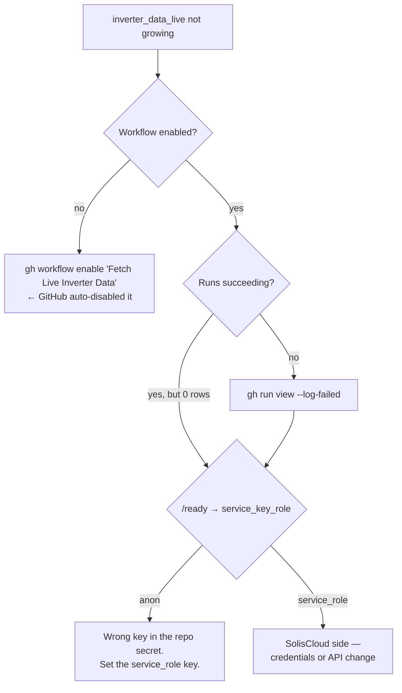

# Runbook

Operating procedures and incident response.

For *how the system works*, read [`ARCHITECTURE.md`](./ARCHITECTURE.md). This document assumes
you already know that and something is wrong.

---

## Quick reference

```bash
# Health
curl -s https://solaredge.anujajay.com/healthz | jq   # is it up?
curl -s https://solaredge.anujajay.com/ready   | jq   # can it serve?

# Local
pnpm dev                                # dev server
pnpm test                               # 91 tests
pnpm lint                               # 0 errors expected
pnpm build                              # production build
pnpm audit --prod --audit-level high    # the CI security gate

# Workflows
gh workflow list
gh run list --limit 10
gh workflow run "DB Snapshot"
```

**Before anything that writes: take a DB Snapshot.** It is a manual, read-only workflow that
exports every table plus the schema as a downloadable artifact. It costs two minutes.

---

## The workflows

| Workflow | Trigger | What it does | If it fails |
|---|---|---|---|
| Fetch Live Inverter Data | every 5 min | SolisCloud → `inverter_data_live` | [No live data](#no-live-inverter-data) |
| Generate Daily Inverter Summary | `30 1 * * *` | aggregates → `inverter_data_daily_summary` | [Summary failing](#daily-summary-failing) |
| Data Freshness Check | daily | opens a `data-outage` issue if rows stop arriving | It *is* the alarm — read the issue |
| Keepalive | `17 3 */10 * *` + push to `main` | heartbeat commit, re-enables schedules | [Workflows disabled](#workflows-silently-disabled) |
| Backfill Daily Summaries | manual | rebuilds gaps from the Solis month API | [Backfill](#backfilling-a-gap) |
| DB Snapshot | manual | read-only export of tables + schema | — |
| ci | push / PR | lint · test · build · prod audit | All four are mandatory |

---

## Incidents

### No live inverter data

**Symptom:** dashboard shows stale figures; `inverter_data_live` stops growing.

This is the failure that ran undetected for five months. Work the causes in this order — they
are ordered by how often each has actually been the answer.



1. **Is the workflow enabled?**
   ```bash
   gh workflow list --all      # look for 'disabled_inactivity'
   gh workflow enable "Fetch Live Inverter Data (Every 5 Minutes)"
   ```
   GitHub disables scheduled workflows in a repo with no commits for 60 days, and announces it
   nowhere. An 88-day commit gap is what did it. `keepalive.yml` now prevents this, but check
   it first anyway — it is free and it was the answer once.

2. **Are runs failing?**
   ```bash
   gh run list --workflow="Fetch Live Inverter Data (Every 5 Minutes)" --limit 5
   gh run view <run-id> --log-failed
   ```

3. **Are runs "succeeding" but inserting nothing?** Check for
   `new row violates row-level security policy`. That means `SUPABASE_SERVICE_KEY` holds an
   **anon** key. Confirm with `curl -s .../ready | jq .checks.service_key_role`, then:
   ```bash
   gh secret set SUPABASE_SERVICE_KEY     # paste the service_role key
   ```
   > Vercel and GitHub Actions hold this secret **separately**. Fixing one does not fix the
   > other. Both have been wrong, at different times.

4. **SolisCloud itself.** Credentials rotated, or the API changed. `POST /api/solis/explore`
   is the diagnostic proxy.

### Daily summary failing

The job **fails deliberately** when it processes zero rows — "SolisCloud returned nothing" and
"there was nothing to do" used to be indistinguishable, and the silent version of this bug is
what hid the five-month outage.

So first: **is this a real failure or a legitimate empty window?** The job checks
`inverter_data_live`'s row count before failing. If that table is genuinely near-empty (e.g.
immediately after a recovery), the failure is correct but uninteresting — fix the *live*
collector and this resolves itself. If the live table is healthy and the summary still fails,
the aggregation is at fault.

### Workflows silently disabled

```bash
gh workflow list --all
gh workflow enable "<name>"
```

`keepalive.yml` re-enables the schedules on every push to `main` and makes a heartbeat commit
every ten days. If it has itself been disabled, enable it first — it repairs the others.

### Bill upload returns 500

A layered failure with a documented history. Check in order:

1. **Config.** `curl -s .../ready | jq .checks` — a `config` failure names the variable.
2. **Is the body our JSON or Vercel's HTML?** An HTML error page means the function crashed at
   **module load**, before any `try/catch` could run — almost always a missing dependency.
3. **Is every `api/` import in `dependencies`?** Vercel ships only `dependencies` into the
   function bundle, never `devDependencies`. `tests/runtimeDependencies.test.js` enforces this;
   run `pnpm test` before assuming otherwise.
4. **Read the real response body.** Bare 500s are undiagnosable from the outside. Getting the
   actual body — from the browser, with a live session token — is what finally resolved this
   last time, after several blind deploy cycles. Do it early, not late.

```bash
vercel logs <deployment-url>          # runtime logs
```

### Bill extraction produces wrong or empty figures

Almost certainly a **bill format change**. The parser is nine regexes pinned to the bill's text
layout, not OCR and not AI.

1. Extract the text and look at it:
   ```bash
   node -e "import('./api/_lib/pdfText.js').then(async m => \
     console.log(await m.extractPdfText(require('fs').readFileSync('bill.pdf'))))"
   ```
2. Compare against `tests/fixtures/ceb-bill-2026.txt`.
3. The fragile one is `meterRow` — `\t(\d+)\t(\d{4}-\d{2}-\d{2})`. It depends on table cells
   arriving **tab-delimited**, which is invisible on the page. If the tabs are gone, that
   anchor is what broke.
4. Fix the regex in `api/_lib/cebBillParser.js`, **add the new format as a fixture**, and
   assert on specific values — not just the match count.

> **Redact before committing a fixture.** Real bills carry the account holder's name, address
> and phone number.

---

## Routine procedures

### Backfilling a gap

```bash
gh workflow run "DB Snapshot"                 # 1. ALWAYS first
gh workflow run "Backfill Daily Summaries"    # 2. dry run BY DEFAULT
gh run view <run-id> --log                    # 3. read what it WOULD write
# 4. only then re-run with the write flag
```

The dry run is the default for a reason. Read its output against the Solis month API before
letting it write; this job rebuilds historical data, and a wrong backfill is far harder to
notice than a missing one.

**`null` is not `0`.** A gap the backfill cannot fill must stay `null`. Writing `0` fabricates
a measured zero that is indistinguishable from real data once it lands, and drags every average
down while looking plausible. This has corrupted the dataset twice.

### Adding a bill

1. Admin dashboard → CEB Billing → upload the PDF.
2. Extraction runs automatically; the result lands in the verification queue.
3. **Review it even when `auto_approved`.** Validation proves the bill is *internally
   consistent* — it cannot prove the right bill was parsed, or that the regexes latched onto
   the right table rows.
4. Approve. The record is written to `ceb_data` and the ingestion is marked `approved`.

Duplicates are caught by SHA-256 before storage, so re-uploading is safe.

### Verifying the data trail

The integrity checks worth running after any bulk change:

```sql
-- contiguous periods: each start should be the previous end + 1 day
select bill_date, billing_period_start, billing_period_end,
       billing_period_start - lag(billing_period_end) over (order by bill_date) as gap_days
from ceb_data order by bill_date;

-- meter delta must equal units_exported
select bill_date, units_exported,
       meter_reading - lag(meter_reading) over (order by bill_date) as meter_delta
from ceb_data order by bill_date;

-- no duplicates
select bill_date, count(*) from ceb_data group by bill_date having count(*) > 1;
```

`gap_days` should be `1` on every row. `meter_delta` should equal `units_exported`. The sum of
`units_exported` should equal the total meter delta across the whole span — an independent
checksum, since it comes from different fields.

### Pruning duplicate bill files

The `ceb_bills` bucket can accumulate objects that no ingestion row references — test uploads,
or files whose ingestion was deleted. They are invisible in the UI and carry the account
holder's name, address and phone number, so they are worth removing.

**Never delete by "looks unreferenced" alone.** Prove by content hash that nothing unique is
lost:

```sql
-- how many objects are unreferenced?
select count(*) from storage.objects o
where o.bucket_id = 'ceb_bills'
  and not exists (select 1 from ceb_bill_ingestions i where i.file_path = o.name);
```

Then, for each unreferenced object, download it, SHA-256 it, and compare against
`ceb_bill_ingestions.file_sha256`. Delete **only** the ones that match a bill you keep; leave
anything whose content is not otherwise held, and investigate it instead.

Afterwards the object count should equal the ingestion count exactly.

> As of 2026-09-13 there are 19 such objects, all verified byte-identical to bills already
> kept. They are safe to remove and have not been removed yet.

### Reading Edge Function failures

`solis-live-data` backs the live-power widget. When it misbehaves, the status code says whose
fault it is:

| Status | Meaning |
|---|---|
| `500` | **Ours** — a Supabase secret is missing. The body names which. |
| `502` | **SolisCloud** — rejected us, declined, or was unreachable after 3 attempts |

It retries transport failures and 5xx three times with exponential backoff and full jitter,
8s timeout per attempt. It does **not** retry 4xx or a `success: false` body — a bad signature
and a declined request do not improve on repetition.

```sql
-- in Supabase → Logs, or via the MCP log query
select timestamp, event_message from logs
where source = 'function_logs' and event_message ilike '%Solis%'
order by timestamp desc limit 20;
```

A run of `SolisCloud returned 502 (attempt 1/3)` warnings followed by a 200 is the retry
working as designed, not an incident.

### Rotating credentials

Each secret lives in **two or three** places, configured separately. Missing one is the
standard way to half-break the system.

| Secret | Vercel | GitHub Actions | Local `.env` |
|---|---|---|---|
| `SUPABASE_SERVICE_KEY` | ✅ | ✅ | ✅ |
| `CLERK_SECRET_KEY` | ✅ | — | ✅ |
| `SOLIS_API_ID` / `SOLIS_API_SECRET` | ✅ | ✅ | ✅ |
| `VITE_*` | ✅ | — | ✅ |

```bash
vercel env rm  <NAME> production && vercel env add <NAME> production
gh secret set  <NAME>
curl -s https://solaredge.anujajay.com/ready | jq   # verify after
```

After rotating `SUPABASE_SERVICE_KEY`, confirm `service_key_role` still reads `service_role`.
Pasting the anon key here is the single most repeated mistake in this project's history.

### Deploying

`main` auto-deploys to production. CI must pass all four gates — lint, test, build, prod audit.
None is `--if-present`; two of them silently passed for months before that was fixed.

```bash
curl -s https://solaredge.anujajay.com/ready | jq   # smoke test after deploy
```

---

## Escalation

There is no on-call rotation — this is a single-owner project. In practice:

1. `/ready` tells you whether config and the database are fine.
2. `gh run list` tells you whether collection is fine.
3. The `data-outage` issue, if one is open, tells you when it stopped.

If all three look healthy and the numbers still look wrong, the problem is **semantic** rather
than operational — start at [LR-001](./logic-registry/LR-001-ceb-vs-inverter-monthly-alignment.md),
because a month-offset error produces wrong figures that look entirely plausible.
